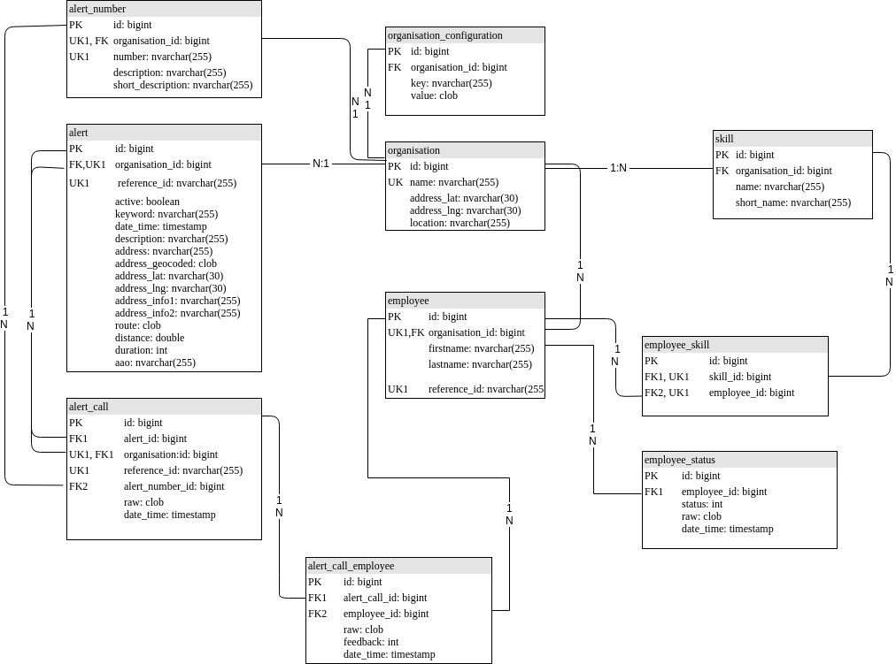

# Development

## Start Application
The following steps are necessary to start the application for development:

* Set SpringProfile to local i.e. via env variable `SPRING_PROFILES_ACTIVE=local`

* Set the env variable `GRAPHHOPPER_APIKEY=xxxxx-xxxx-xxxx-xxxx-xxxxxxxxx`
(register for a free account [here](https://graphhopper.com/dashboard/#/register) and generate your apikey) 

* Set the env variable `MAPBOX_ACCESS_TOKEN=xxxxxxxxxxxxxxxxxxxxxxxxx`
(register for a free account [here](https://www.mapbox.com/) and generate your accesstoken)

* Start the Spring Application `src/main/java/com/alarmcontrol/server/ServerApplication.java` ( i.e. in your IDE)

* Install node_modules inside the folder `frontend` with `npm install`

* Start react client inside the folder `frontend` with `npm run start`

## Start Application Environment
The following steps are not necessary for development, but could be handy:

### Graylog
Start Graylogserver

```
sudo docker-compose -f docker-compose.logging.yaml up
```

The Ui is available at http://localhost:9000

Default credentials are:

Username: admin
Password: admin

#### Import Content-Pack
If you initially started the Graylogserver import the content pack:
* Login to Graylog 
* System > Content Packs > Upload
(Use this File: `misc/graylog/content-packs/content-pack-alarmcontrol.json`)

* System > Content Packs > Alarmcontrol_Dev > Install

### Mailhog
Start Mailhog as the Mailserver and configure it as EnvironmentVariable
 to send mails and view it on the Mailhog WebUi (http://localhost:8025)

```
sudo docker-compose -f docker-compose.notifications.yaml up
```

The Ui is available at http://localhost:8025

## Database
* **H2Console**: http://localhost:8080/h2-console

ChangeConnection String to `jdbc:h2:./test`

Liquibase Database definition:
src/main/resources/db/changelog/db.changelog-master.yaml

### ERM


## GraphQL
Entrypoint for Webrequests `src/main/java/com/alarmcontrol/server/data/graphql/*`:

All classes that implements 
`GraphQLQueryResolver`, 
`GraphQLMutationResolver` or 
`GraphQLSubscriptionResolver`

GraphQL-Schema:
src/main/resources/graphql/schema.graphqls

Introduction:
https://www.graphql-java.com/tutorials/getting-started-with-spring-boot/

* **Editor**: http://localhost:8080/graphiql
* **Schema**: http://localhost:8080/graphql/schema.json

## Testdata

### Add via Script
This script is intentionally for the e2e tests but could also be used to initially setup a db for development purposes
```
URL="http://localhost:8080/graphql" e2eTests/tests/initialSetup.sh
```

### Add via GraphQL-Editor
Go to `http://localhost:8080/graphiql` and execute the following Mutations: 

##### Add an Organisation
```
mutation { 
  newOrganisation(
    name: "FF Meimbressen"
    addressLat: "51.406339"
    addressLng: "9.359186"
  ){id}
}
```

##### Add AlertNumber
```
mutation { 
  newAlertNumber (
    organisationId: 1
    number: "123456-S04"
    shortDescription: "Pager"
    description: "Pager Meimbressen"
  ){id}
}
```

```
mutation { 
  newAlertNumber (
    organisationId: 1
    number: "123456-S20"
    shortDescription: "Pager (Volla.)"
    description: "Vollalarm aller Pager"
  ){id}
}
```


```
mutation { 
  newAlertNumber (
    organisationId: 1
    number: "123456-S54"
    shortDescription: "Sirene"
    description: "Sirene Meimbressen"
  ){id}
}
```

```
mutation { 
  newAlertNumber (
    organisationId: 1
    number: "123456-S50"
    shortDescription: "Sirene (Volla.)"
    description: "Vollalarm aller Sirenen"
  ){id}
}
```


```
mutation { 
  newAlertNumber (
    organisationId: 1
    number: "123456-S23"
    shortDescription: "AGTs"
    description: "Alle Atemschutzgeräteträger"
  ){id}
}
```


##### Add Skills
```
mutation { 
  newSkill (
    organisationId: 1
    name: "Atemschutzgeräteträger"
    shortName: "AGT"
    displayAtOverview: true    
  ){id}
}
```

```
mutation { 
  newSkill (
    organisationId: 1
    name: "Führungskraft"
    shortName: "FK"
    displayAtOverview: true    
  ){id}
}
```

```
mutation { 
  newSkill (
    organisationId: 1
    name: "Min. C1 (Fahrer > 3,5t)"
    shortName: "C1"
    displayAtOverview: true    
  ){id}
}
```

##### Add Employees
```
mutation { 
  newEmployee(
    organisationId: 1
    firstname: "Lars"
    lastname: "Laune"
    referenceId: "1234"
  ){id}
}
```
```
mutation { 
  newEmployee(
    organisationId: 1
    firstname: "Malte"
    lastname: "Malteser"
    referenceId: "2345"
  ){id}
}
```
```
mutation { 
  newEmployee(
    organisationId: 1
    firstname: "Erika"
    lastname: "Mustermann"
    referenceId: "3456"
  ){id}
}
```
```
mutation { 
  newEmployee(
    organisationId: 1
    firstname: "Max"
    lastname: "Mustermann"
    referenceId: "4567"
  ){id}
}
```

##### Set Employee Skills
```
mutation { 
  addEmployeeSkill(employeeId: 1, skillId: 1)
}
```

```
mutation { 
  addEmployeeSkill(employeeId:1, skillId: 2)
}
```

```
mutation { 
  addEmployeeSkill(employeeId:2, skillId: 1)
}
```

##### Add an AlertCall 
Creates an AlertCall and implicitly creates an Alert if alertReferenceId not exists
```
mutation { 
  newAlertCall(
    organisationId: 1
    alertNumber: "123456-S04"
    alertReferenceId: "B123456"
    alertCallReferenceId: "123"
    keyword: "H1"
    address:"Hinter den Gärten 8, 34379 Calden"
    # dateTime: "2019-05-03T12:23:32.456Z"
  ){
    id
    alert {
      id
    }
  }
}
```

##### Add Employee Feedback
```
mutation { 
  addEmployeeFeedback(
    organisationId: 1
    alertCallReferenceId: "123"
    employeeReferenceId: "2345"
    feedback: COMMIT) {
    feedback
  }
}
```

```
mutation { 
  addEmployeeFeedback(
    organisationId: 1
    alertCallReferenceId: "123"
    employeeReferenceId: "4567"
    feedback: CANCEL) {
    feedback
  }
}
```

##### Add Employee Status
```
mutation { 
  addEmployeeStatus(
    organisationId: 1
    employeeReferenceId: "2345"
    status: AVAILABLE) {
    status
  }
}
```

##### Query an Alert
```
query {
  alertById(id: 1) {
    id
    keyword
    dateTime
    organisation {
      id
      name
    }
  }
}
```

### Client
The client is running by default at http://localhost:1234

## Components

### Server
* **Framework**: Spring Boot
* **DB-Setup**: Spring Data JPA with Hibernate. Bootstrapped by Liquibase
* **Data-API**: GraphQL
* **Routing**: https://docs.graphhopper.com/
* **Geocoding**: https://wiki.openstreetmap.org/wiki/Nominatim or https://docs.mapbox.com/api/search/#geocoding

### Client
* **Routing**: react-router
(https://reacttraining.com/react-router/web/example/basic)
* **GraphQl**: Apollo Client (https://www.apollographql.com/docs/react/essentials/get-started)
* **GUI**: React-Bootstrap (https://react-bootstrap.github.io/layout/grid/)
* **Icons**: React-Fontawesome (https://github.com/FortAwesome/react-fontawesome) (Browse: https://fontawesome.com/icons?d=gallery) Don't forget to add the icon to the icon-lib in `index.js`

## API
Use the api if you want your device to add alerts to the system.
Entrypoint for Webrequests: `src/main/java/com/alarmcontrol/server/api/ExternalRequestsController.java`

Add an Alert
```
curl  -X POST localhost:8080/api/alert \
      -H 'Content-Type: application/json' \
      -d '{ 
            "organisationId":"1", 
            "gssi":"123456", 
            "id":"321", 
            "text":"&54S54*STELLEN SIE EINSATZBEREITSCHAFT HER B123456778*H1*FÜRSTENWALD HINTER DEN GÄRTEN 8 CALDEN"
          }'
```

Workaround for problems with spaces. Specify an character that is used as whitespace.
```
curl  -X POST localhost:8080/api/alert \
      -H 'Content-Type: application/json' \
      -d '{ 
            "organisationId":"1", 
            "gssi":"123456", 
            "id":"321", 
            "text":"&54S54*STELLEN#SIE#EINSATZBEREITSCHAFT#HER#B123456778*H1*FÜRSTENWALD#HINTER#DEN#GÄRTEN#8#CALDEN",
            "whitespaceReplacementChar" : "#" 
          }'
```

Add an EmployeeFeedback
```
curl  -X POST localhost:8080/api/employeeFeedback \
      -H 'Content-Type: application/json' \
      -d '{ 
            "organisationId":"1", 
            "issi":"1234", 
            "id":"321", 
            "ur":"32768" 
          }'
```

Add an EmployeeStatus
```
curl  -X POST localhost:8080/api/employeeStatus \
      -H 'Content-Type: application/json' \
      -d '{ 
            "organisationId":"1", 
            "issi":"1234",
            "status":"15" 
          }'
```

## Tests

### Backend
Execute backend tests with mvn
```
mvn test
```

### Frontend
Execute frontend tests with jest
```
npm --prefix frontend/ run test
```

### End to End Tests (E2E)
The End to End Tests are located at `<RepositoryRoot>/e2eTests`

Execute End to End Tests with the following script

```
GRAPHHOPPER_APIKEY="xxx" \
MAPBOX_ACCESS_TOKEN="xxx" \
e2eTests/executeE2ETests.sh
```
